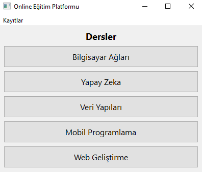
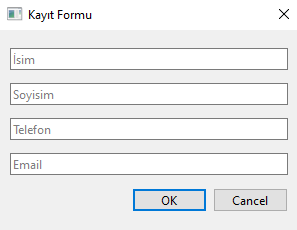
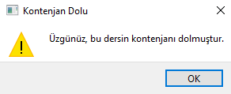
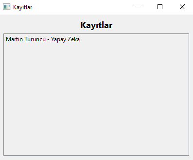
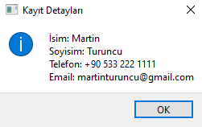

# Online Eğitim Platformu
Bu belge, Python'da PyQt6 kullanılarak geliştirilmiş bir Online Eğitim Platformu uygulamasının çalışma adımlarını görsel olarak açıklamaktadır.

## Ders Seçimi:
Kullanıcı, çeşitli dersler arasından birini seçer veya kayıtlı derslere göz atabilir.

## Kayıt Olma:
Kullanıcı seçtiği ders için kayıt olmak istediğinde bir form açılır. İsim, soyisim, telefon ve e-posta bilgilerini girmesi istenir.

## Kayıt Onayı:
Kullanıcı bilgileri girdikten sonra "OK" düğmesine tıklar. Eğer kontenjan doluysa uyarı alır, aksi halde kayıt tamamlanır.

## Kayıtları Görüntüleme:
Kullanıcı, menüden "Kayıtlar" seçeneğine tıklayarak kayıtlı öğrencileri görebilir.

## Kayıt Detayları:
Kullanıcı bir öğrencinin adına tıkladığında, o öğrencinin detaylarını içeren bir iletişim kutusu açılır.

Bu şekilde, Online Eğitim Platformu uygulaması başarıyla kullanıcı etkileşimlerini gerçekleştirir.
